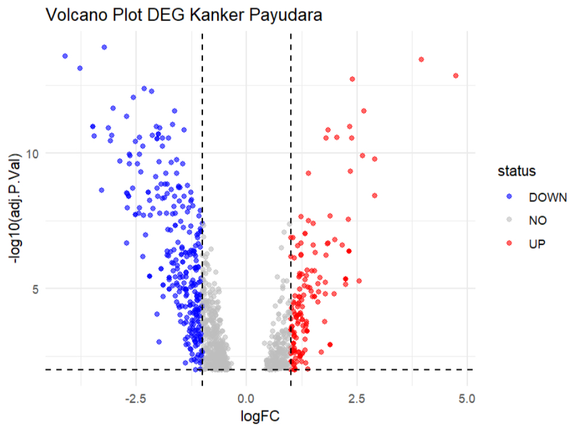
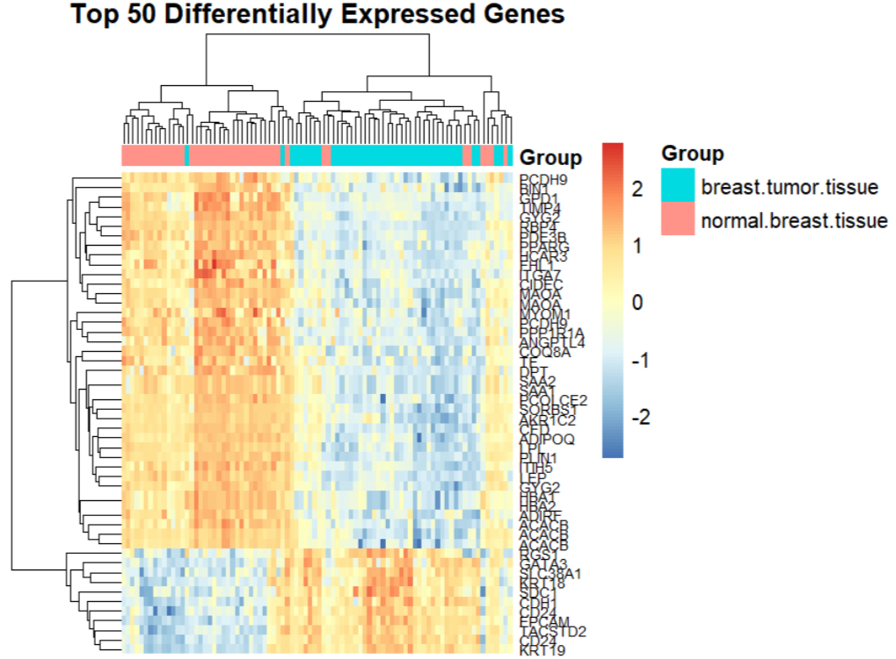
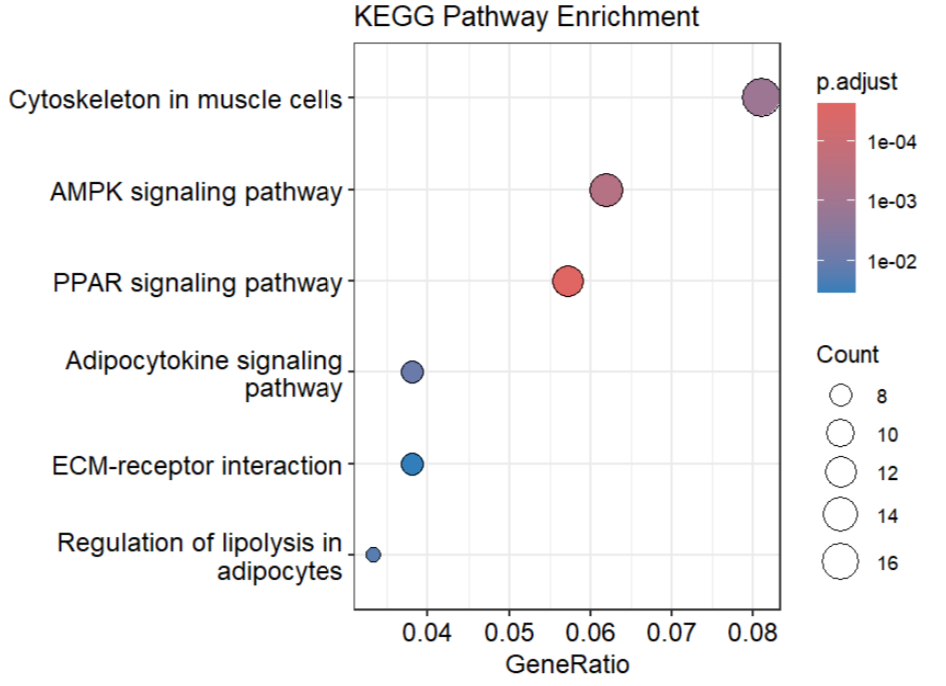

# MINI-PROJECT-BIOINFORMATIKA
# Analisis Ekspresi Gen Diferensial dan Enrichment Pathway pada Dataset Kanker Payudara GSE15852

## Background

Studi ini bertujuan untuk melakukan analisis Differentially Expressed Genes (DEGs) pada dataset transcriptomics kanker payudara menggunakan pendekatan bioinformatika berbasis R. Dataset yang digunakan adalah GSE15852 yang diperoleh dari Gene Expression Omnibus (GEO), yang membandingkan jaringan kanker payudara dengan jaringan normal.

Kanker payudara berkembang akibat akumulasi perubahan molekuler yang memengaruhi proliferasi sel, regulasi apoptosis, diferensiasi sel, dan reprogramming metabolik. Analisis transcriptomics memungkinkan identifikasi gen-gen penting yang berperan dalam mekanisme molekuler tersebut.

---

# Project Objective

Proyek ini bertujuan untuk:

- Mengidentifikasi Differentially Expressed Genes (DEGs) pada dataset kanker payudara GSE15852
- Menganalisis pola perubahan ekspresi gen antara jaringan kanker dan jaringan normal
- Mengevaluasi keterlibatan gen signifikan dalam proses biologis dan jalur molekuler menggunakan analisis GO dan KEGG pathway

---

# Dataset Information

| Keterangan | Informasi |
|---|---|
| Dataset | GSE15852 |
| Sumber | Gene Expression Omnibus (GEO) |
| Tipe Data | Microarray |
| Organisme | Homo sapiens |

---

# Analytical Environment

Analisis dilakukan menggunakan bahasa pemrograman R dan RStudio dengan package berikut:

- GEOquery
- limma
- dplyr
- ggplot2
- pheatmap
- clusterProfiler
- org.Hs.eg.db

---

# Analysis Workflow

1. Pengambilan dataset dari GEO
2. Differential Expression Analysis menggunakan limma
3. Identifikasi gen upregulated dan downregulated
4. Visualisasi hasil menggunakan volcano plot dan heatmap
5. Functional enrichment analysis (GO dan KEGG)
6. Interpretasi biologis hasil analisis

---

# Differential Expression Analysis

Analisis Differentially Expressed Genes (DEGs) dilakukan menggunakan metode linear modeling melalui package **limma** dengan kriteria:

- Adjusted p-value (FDR) < 0.05
- |logFC| > 1

Gen dengan logFC positif dikategorikan sebagai **upregulated**, sedangkan gen dengan logFC negatif dikategorikan sebagai **downregulated**.

---

# Key Results

## Differentially Expressed Genes (DEGs)

### Upregulated Genes

- KRT19
- CD24
- EPCAM
- TACSTD2
- KRT18

Gen-gen tersebut berkaitan dengan proliferasi sel epitel, adhesi sel, dan karakteristik molekuler tumor.

### Downregulated Genes

- RBP4
- ACACB
- LPL
- ADIPOQ
- PPP1R1A

Sebagian besar gen tersebut berkaitan dengan metabolisme lipid dan fungsi jaringan adiposa.

---

# Volcano Plot

Volcano plot menunjukkan distribusi gen berdasarkan magnitude perubahan ekspresi dan tingkat signifikansi statistik.

  

Visualisasi menunjukkan banyak gen melewati ambang signifikansi dan threshold logFC, yang menandakan adanya perbedaan ekspresi gen yang kuat antara jaringan kanker dan jaringan normal.

---

# Heatmap Analysis

Heatmap dilakukan terhadap 50 DEGs teratas berdasarkan adjusted p-value dan magnitude perubahan ekspresi.

  

Hasil heatmap menunjukkan pemisahan klaster yang jelas antara sampel kanker dan jaringan normal. Pola ekspresi gen yang konsisten menunjukkan adanya sinyal biologis yang kuat.

---

# Functional Enrichment Analysis

## Gene Ontology (GO)

Analisis GO menunjukkan keterlibatan gen dalam:

- Regulasi metabolisme lipid
- Proliferasi sel
- Respons hormonal
- Organisasi struktur sel

---

## KEGG Pathway

Pathway signifikan yang diperoleh antara lain:

- AMPK signaling pathway
- PPAR signaling pathway
- ECM-receptor interaction
- Adipocytokine signaling pathway

  

Hasil enrichment menunjukkan adanya metabolic reprogramming dan perubahan interaksi sel dengan lingkungan mikro tumor.

---

# Biological Interpretation

Hasil analisis menunjukkan bahwa kanker payudara mengalami perubahan molekuler kompleks yang melibatkan:

- Aktivasi jalur proliferatif dan epitelial
- Penurunan regulasi metabolisme lipid normal
- Perubahan homeostasis jaringan
- Adaptasi metabolik untuk mendukung pertumbuhan tumor

---

# Conclusion

Analisis bioinformatika pada dataset GSE15852 berhasil mengidentifikasi sejumlah Differentially Expressed Genes (DEGs) yang menunjukkan perbedaan ekspresi signifikan antara jaringan kanker payudara dan jaringan normal. Functional enrichment analysis menunjukkan keterlibatan pathway metabolisme energi, proliferasi sel, dan interaksi mikro lingkungan tumor dalam perkembangan kanker payudara.

---

# References

NCBI Gene Expression Omnibus (GEO). Dataset GSE15852
Ni, I. B. P., Zakaria, Z., Muhammad, R., Abdullah, N., Ibrahim, N., Emran, N. A., et al. (2010). Gene expression patterns distinguish breast carcinomas from normal breast tissues: the Malaysian context. Pathology-Research and Practice, 206(4), 223–228.

